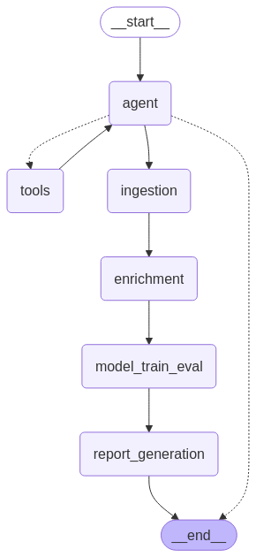

# Financial Market Analysis and Reporting System

## Overview

The **Financial Market Analysis and Reporting System** is a modular framework designed to ingest, analyze, and predict financial market trends using **LangGraph**. It provides actionable insights for financial analysts by leveraging **machine learning models**, structured reporting, and visualizations.

This system supports **human-in-the-loop analysis** by allowing analysts to **review and edit insights** before finalizing reports. It utilizes the **LangGraph interrupt function** to pause the workflow for human intervention and resume after modifications.

## Features

- **Data Ingestion and Preprocessing:** Fetches financial data and news from APIs or web scrapers.
- **Market Analysis & Predictive Modeling:** Uses ML models (e.g., Auto ARIMA) to predict stock or currency price movements.
- **Report Generation & Visualization:** Generates insights, tabulated reports, and graphical representations of trends.
- **Interactive Analyst Review:** Analysts can review, modify, and enhance generated insights before final reports are created.
- **Human-in-the-Loop Processing:** LangGraph’s interrupt function enables workflow pausing and resuming after expert review.
- **Evaluation Metrics:** Implements accuracy metrics (e.g., RMSE, MAPE) to assess model performance.

## Tech Stack

- **LangGraph** - Modular pipeline framework
- **FastAPI** - API backend (Hosted on Render: [Gamma Agents API](https://gamma-agents.onrender.com))
- **Python** (NumPy, Pandas, Scikit-learn, Statsmodels, Matplotlib, Seaborn, Tabulate)
- **Groq API (Llama 3.3-70B Versatile LLM)** - AI-powered insights

## API Access

The hosted backend API can be accessed via:

- Swagger UI: [Gamma Agents Docs](https://gamma-agents.onrender.com/docs)
  
- Redoc UI: [Gamma Agents Redoc](https://gamma-agents.onrender.com/redoc)

## Installation & Setup

### 1. Clone the Repository

```sh
git clone https://github.com/uche-madu/gamma-agents.git
cd gamma-agents
```

### 2. Create a Virtual Environment

```sh
python -m venv venv
source venv/bin/activate  # On Windows: venv\Scripts\activate
```

### 3. Install Dependencies

```sh
pip install -r requirements.txt
```

### 4. Configure Environment Variables

Create a `.env` file based on `.env.example`:

```sh
cp .env.example .env
```

Edit `.env` and add required API keys:

```ini
GROQ_API_KEY=your_groq_api_key
LANGSMITH_TRACING=true
LANGSMITH_ENDPOINT="https://api.smith.langchain.com"
LANGSMITH_API_KEY=your_langsmith_api_key
LANGSMITH_PROJECT=your_project_name
```

## How It Works

### Request

The client sends a **POST request** to `/api``/analyze` with a JSON body:

```json
{
    "query": "I need to analyze Nvidia stock data.",
    "edited_insights": "These are the analyst's edited insights after review."
}
```

### Processing

1. The **analyze\_stock** function runs the LangGraph workflow asynchronously.
2. If an analyst needs to modify insights, the workflow **pauses using LangGraph’s interrupt function**.
3. Once modifications are complete, the workflow **resumes execution** and finalizes the report.

### Response

The API returns a JSON response with the **PDF report link** and **final insights**:

```json
{
    "pdf_report": "temp_images/NVDA_financial_report.pdf",
    "insights": "Final insights text from the resumed workflow..."
}
```

## LangGraph Workflow

Below is the **LangGraph** workflow structure, which showcases how different components interact:



### Workflow Nodes

1. **Agent Node (`agent`)** - Calls the LLM to analyze the request.
2. **Tools Node (`tools`)** - Executes any required tools (e.g., fetching stock tickers from Yahoo Finance).
3. **Data Ingestion Node (`ingestion`)** - Retrieves and processes financial data.
4. **Data Enrichment Node (`enrichment`)** - Enhances raw data with additional analysis.
5. **Model Training & Evaluation (`model_train_eval`)** - Runs ML models to generate forecasts.
6. **Report Generation (`report_generation`)** - Compiles insights into a structured format.
7. **Human Review (`human_review`)** - Allows manual review and editing before finalization.

### Stock Ticker Tool

A key tool used in this workflow is the **Stock Ticker Retrieval Tool**, which fetches stock ticker symbols from Yahoo Finance:

```python
@tool
def stock_ticker_tool(
    company_name: str,
    tool_call_id: Annotated[str, InjectedToolCallId], 
    config: RunnableConfig    
) -> Command:
    """Retrieves the stock ticker symbol for a given public company name from Yahoo Finance."""
    try:
        search_results = search(company_name)  # Perform Yahoo Finance search
        
        if "quotes" in search_results:
            for quote in search_results["quotes"]:
                if "symbol" in quote:
                    ticker = quote["symbol"]
                    return Command(
                        update={
                            "ticker": ticker,  # Update ticker in state
                            "messages": [
                                ToolMessage(
                                    f"Successfully added {company_name}'s ticker symbol to State", 
                                    tool_call_id=tool_call_id
                                )
                            ]
                        },
                    )
        return Command(
            update={
                "ticker": "",
                "messages": [ToolMessage(f"Ticker for {company_name} not found.", tool_call_id=tool_call_id)]
            },
        )
    except Exception as e:
        return Command(
            update={
                "ticker": "",
                "messages": [ToolMessage(f"Error retrieving ticker: {str(e)}", tool_call_id=tool_call_id)]        
            },
        )
```

This tool is **bound to the LLM** and executed during the workflow to retrieve relevant stock data.

## Evaluation Metrics

To ensure the accuracy and effectiveness of the predictive models, we use the following evaluation metrics:

- **Mean Absolute Error (MAE):** Calculates the average magnitude of prediction errors.

## Areas for Improvement

While this system is functional, the following enhancements can make it **production-ready**:

- **Database Integration:** Use **PostgreSQL or Supabase** to store historical reports and insights.
- **Real-Time Streaming:** Introduce **Kafka** for continuous data ingestion.
- **Enhanced Visualization:** Add **interactive dashboards** for trend analysis.
- **Automated Model Retraining:** Implement **auto-retraining of ML models** based on new market conditions.

## Contributing

1. Fork the repository
2. Create a feature branch (`git checkout -b feature-name`)
3. Commit your changes (`git commit -m "Added new feature"`)
4. Push to your branch (`git push origin feature-name`)
5. Open a pull request

## License

This project is licensed under the MIT License.

---

🚀 **Now you're ready to analyze financial markets with AI!**
